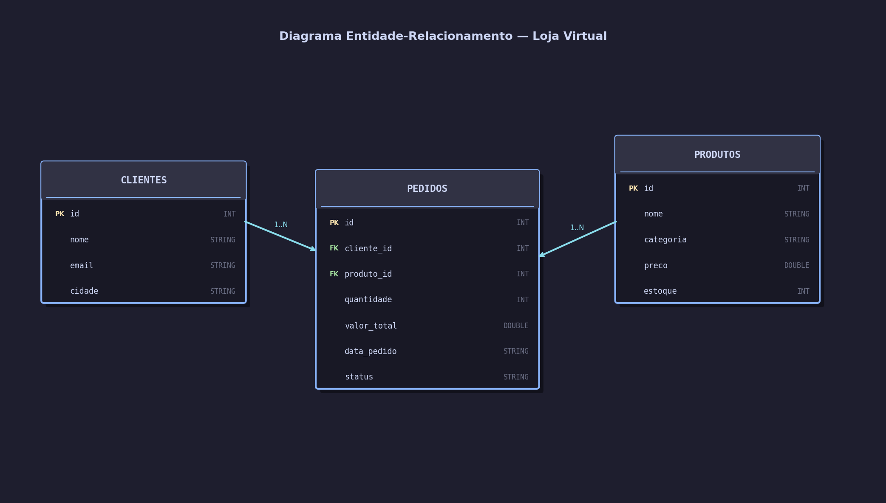

# Apache Spark com Delta Lake e Apache Iceberg

## Contextualização do Trabalho

Este é um trabalho da disciplina de **Engenharia de Dados** do curso de Engenharia de Software da **SATC (2026)**. O objetivo é demonstrar na prática o uso do **Apache Spark (PySpark)** com dois formatos de tabela para Data Lakehouse: **Delta Lake** e **Apache Iceberg**.

---

## Cenário: Loja Virtual

Para demonstrar os conceitos, utilizamos o cenário de uma **Loja Virtual** com três entidades relacionadas:

| Tabela      | Descrição                                         |
|-------------|---------------------------------------------------|
| `clientes`  | Cadastro de clientes com nome, email e cidade     |
| `produtos`  | Catálogo de produtos com categoria, preço e estoque |
| `pedidos`   | Registro de pedidos com status e valor total      |

### Modelo Entidade-Relacionamento



### Fonte de Dados

Os dados são **sintéticos**, gerados diretamente nos notebooks Jupyter. Representam clientes brasileiros, produtos de informática e pedidos com diferentes status de entrega.

---

## Operações Demonstradas

Para ambas as tecnologias (Delta Lake e Iceberg), os notebooks demonstram:

| Operação   | Descrição                                               |
|------------|---------------------------------------------------------|
| **DDL**    | Criação de tabelas com schema explícito                 |
| **INSERT** | Inserção de dados iniciais                              |
| **UPDATE** | Atualização de preços e status                          |
| **DELETE** | Remoção de registros (produtos sem estoque, cancelados) |

---

## Tecnologias Utilizadas

| Tecnologia       | Versão  | Finalidade                             |
|------------------|---------|----------------------------------------|
| Python           | 3.11    | Linguagem principal                    |
| Apache Spark     | 3.5.0   | Motor de processamento distribuído     |
| Delta Lake       | 3.0.0   | Formato de tabela ACID para Data Lakes |
| Apache Iceberg   | 1.4.3   | Formato de tabela aberta para Data Lakes |
| uv               | latest  | Gerenciador de pacotes Python          |
| MKDocs Material  | 9.5+    | Documentação                           |
| JupyterLab       | 4.5+    | Ambiente de notebooks                  |

---

## Estrutura do Projeto

```
trabalho-apachespark/
├── README.md               # Instruções de instalação e uso
├── pyproject.toml          # Dependências (uv)
├── mkdocs.yml              # Configuração da documentação
├── delta/
│   └── delta_lake.ipynb    # Notebook Delta Lake
├── iceberg/
│   └── iceberg.ipynb       # Notebook Apache Iceberg
└── docs/
    ├── index.md            # Esta página
    ├── spark.md            # Explicação do Apache Spark
    ├── delta.md            # Explicação do Delta Lake
    └── iceberg.md          # Explicação do Apache Iceberg
```

---

## Repositório GitHub

O código-fonte completo está disponível em:
[github.com/julianocfelipe/trabalho-apachespark](https://github.com/julianocfelipe/trabalho-apachespark)
